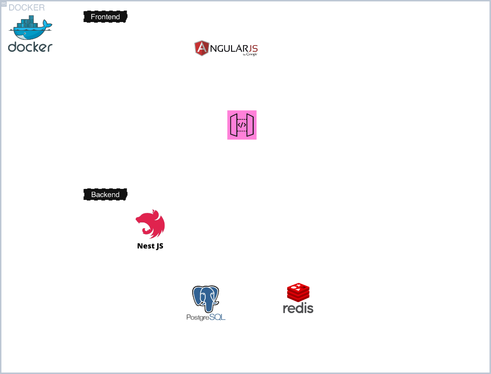
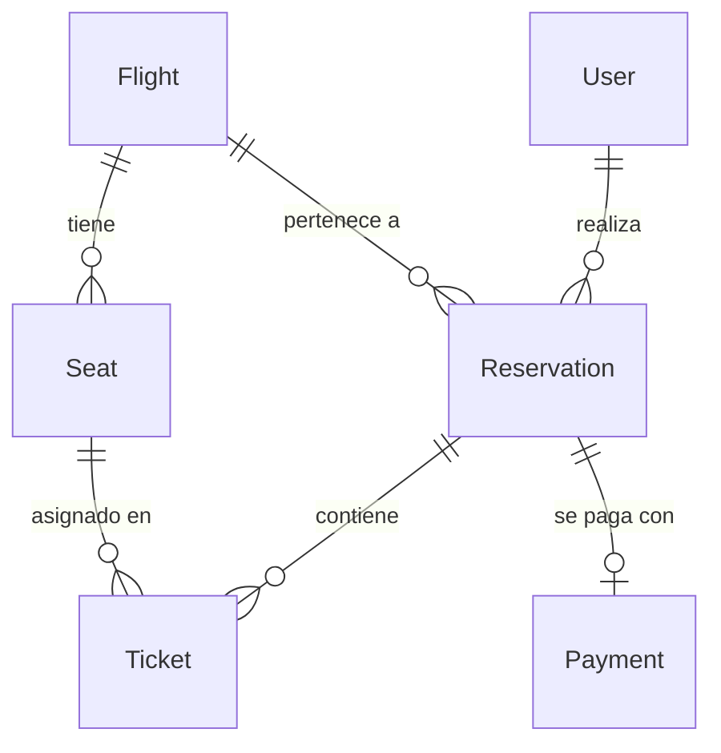

# Diseño y Decisiones de Arquitectura

## Diagrama de Arquitectura

El siguiente diagrama muestra el flujo de componentes y cómo interactúan las distintas piezas del sistema:

## Patrón Arquitectónico: Cliente-Servidor

La aplicación sigue un patrón **Cliente-Servidor** clásico con dos capas bien diferenciadas:

- **Cliente:** Aplicación Angular 18 (SPA) compilada estáticamente y servida por Nginx. El cliente solo se comunica con el servidor a través de llamadas HTTP REST y streams SSE. No tiene acceso directo a ninguna base de datos.
- **Servidor:** API REST implementada con NestJS. Centraliza toda la lógica de negocio, validaciones, acceso a datos y manejo de concurrencia. Está aislado dentro de la red privada de Docker (`flight_network`), sin puertos expuestos al host. Nginx actúa como único punto de entrada público (puerto `4200`), redirigiendo las peticiones `/api/*` al backend de forma segura.

## Arquitectura del Backend: Hexagonal (Puertos y Adaptadores)

Dentro del servidor NestJS, se implementa una **Arquitectura Hexagonal** para separar estrictamente las responsabilidades:

- **Capa de Dominio:** Entidades y reglas de negocio puras (modelos de Flight, Seat, Reservation, Ticket, Payment, User). No dependen de ningún framework ni de la tecnología de persistencia.
- **Capa de Aplicación:** Servicios que orquestan los casos de uso (búsqueda de vuelos, selección de asientos, procesamiento de reservas). Consumen interfaces (puertos) definidas en el dominio.
- **Capa de Infraestructura:** Implementaciones concretas de los puertos. Aquí reside la integración con Prisma ORM (PostgreSQL), ioredis (Redis), y los controladores HTTP de NestJS.

## Patrón de Diseño: Repository

Para desacoplar la lógica de negocio de la tecnología de persistencia se utiliza el **Patrón Repository**:

- Se define una interfaz de repositorio por cada entidad del dominio (ej. `FlightRepository`, `SeatRepository`).
- La implementación concreta de cada repositorio (`PrismaFlightRepository`, `PrismaSeatRepository`) utiliza `PrismaService` internamente para ejecutar las consultas SQL.
- Los servicios de aplicación reciben los repositorios por inyección de dependencias de NestJS, sin conocer si la persistencia es PostgreSQL, MongoDB, o cualquier otro motor.
- Esto facilita enormemente el testing unitario: basta con inyectar un mock del repositorio sin necesidad de levantar la base de datos.

## Manejo de Concurrencia: Bloqueo Distribuido con Redis

El problema central del sistema es evitar el _double booking_ (que dos usuarios reserven el mismo asiento simultáneamente). Se resuelve mediante **Distributed Locking** con Redis:

1. Cuando un usuario selecciona un asiento, el backend ejecuta `SET seat:{flightId}:{seatNumber} {userId} NX EX 600` en Redis.
2. La operación `NX` (Set if Not eXists) es **atómica**: si dos peticiones llegan en el mismo milisegundo, Redis garantiza que solo una tendrá éxito.
3. El `EX 600` establece un TTL de 10 minutos. Si el usuario no completa el pago, el bloqueo expira automáticamente y el asiento vuelve a quedar disponible sin intervención manual.
4. Si el pago se confirma, se persiste la reserva definitiva en PostgreSQL (fuente de la verdad transaccional con garantías ACID) y se libera el lock de Redis.

## Estado en Tiempo Real: Server-Sent Events (SSE)

Para que todos los clientes vean en vivo los cambios de disponibilidad de asientos, se utiliza **SSE** (Server-Sent Events):

- El backend expone un endpoint de streaming unidireccional.
- Cada vez que un asiento cambia de estado (bloqueado, liberado, confirmado), el servidor emite un evento a todos los clientes suscritos.
- Angular escucha este stream y actualiza la UI de la cuadrícula de asientos en tiempo real, sin necesidad de hacer polling.

## Decisiones Técnicas Clave

| Tecnología         | Rol                         | Justificación                                                                                                                 |
| ------------------ | --------------------------- | ----------------------------------------------------------------------------------------------------------------------------- |
| **NestJS**         | Framework backend           | Inyección de dependencias nativa, soporte TypeScript estricto, módulos encapsulados, Exception Filters globales.              |
| **Angular 18**     | Framework frontend          | Framework opinado y tipado, ideal para SPAs robustas con formularios complejos y estado reactivo.                             |
| **PostgreSQL 15**  | Persistencia relacional     | Garantías ACID para transacciones de pago y reservas definitivas.                                                             |
| **Redis 7**        | Bloqueo distribuido y caché | Operaciones atómicas en memoria (`SET NX`), TTL automático, latencia de microsegundos.                                        |
| **Prisma ORM**     | Acceso a datos              | Type-safety completo, migraciones predecibles, generación automática de tipos TypeScript a partir del schema.                 |
| **Nginx**          | Reverse Proxy / API Gateway | Servir estáticos de Angular, redirigir `/api/*` al backend, aislar servicios internos de la red pública.                      |
| **Docker Compose** | Orquestación                | Un solo comando levanta todo el stack (Postgres, Redis, Backend, Frontend+Nginx) con redes aisladas y volúmenes persistentes. |

## Estructura del Modelo de Datos

El modelo relacional (diseñado previo a la implementación y codificado en Prisma) consta de 6 entidades con las siguientes relaciones:

- **User → Reservation:** Un usuario puede tener múltiples reservas.
- **Flight → Seat:** Cada vuelo tiene N asientos con estado (`AVAILABLE`, `LOCKED`, `OCCUPIED`).
- **Reservation → Ticket:** Una reserva agrupa uno o más tickets (uno por pasajero/asiento).
- **Reservation → Payment:** Relación 1:1, cada reserva tiene un único registro de pago.
- **Seat → Ticket:** Cada ticket referencia al asiento específico asignado.
